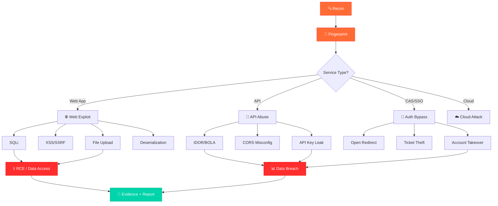

<p align="center">
  
</p>

<p align="center">
  <a href="#"></a>
  <a href="#"></a>
  <a href="#"></a>
  <a href="#"></a>
  <a href="LICENSE"></a>
  <a href="https://hermes-agent.nousresearch.com"></a>
</p>

<p align="center">
  <b>🔥 The most battle-tested offensive security skills library for AI agents 🔥</b><br>
  <i>40 production-grade skills · 15 security domains · Real SRC vulnerability hunting results</i><br>
  <i>Forged from 50+ real-world engagements across hotel · gaming · ride-hailing · IoT · education sectors</i>
</p>

---

<p align="center">
  <a href="#-quick-start">Quick Start</a> •
  <a href="#-skill-universe">Skill Universe</a> •
  <a href="#-attack-chain-map">Attack Chain</a> •
  <a href="#-real-world-results">Results</a> •
  <a href="#-contributing">Contributing</a> •
  <a href="#-license">License</a>
</p>

---

## 🎬 The Story

```
  ┌─────────────────────────────────────────────────────────────────────┐
  │                                                                     │
  │   A junior pentester knows which Nuclei template catches a          │
  │   Spring Boot Actuator exposure, how to chain CORS misconfig        │
  │   with IDOR for account takeover, and when a CAS Open Redirect      │
  │   becomes a ticket theft vector.                                    │
  │                                                                     │
  │   Your AI agent doesn't — unless you give it these skills.          │
  │                                                                     │
  └─────────────────────────────────────────────────────────────────────┘
```

Unlike general-purpose security knowledge bases, this library is:

| 🧠 AI-Native | ⚔️ Battle-Tested | 🌏 Bilingual | 🔗 Chain-Oriented |
|:---:|:---:|:---:|:---:|
| YAML frontmatter (~30 token scan) | Every skill from real SRC engagements | Chinese + English coverage | Skills compose into attack chains |
| Built for [Hermes Agent](https://hermes-agent.nousresearch.com) | Not theoretical checklists | 50+ targets tested | recon → fingerprint → exploit → report |

---

## ⚡ Quick Start

```bash
# 🚀 Clone the skills
git clone https://github.com/zxygeitio/mo-Security-Skills.git

# 📦 Copy to Hermes Agent
cp -r mo-Security-Skills/skills/* ~/.hermes/skills/penetration-testing-learning/

# 🔍 Verify installation
ls ~/.hermes/skills/penetration-testing-learning/ | wc -l
# → 40 skills loaded!
```

<details>
<summary>🐍 <b>Python API — Load skills programmatically</b></summary>

```python
import yaml, re, glob

def scan_skills(path="skills/*/SKILL.md"):
    """Scan all skills via YAML frontmatter (~30 tokens each)"""
    skills = []
    for f in glob.glob(path):
        with open(f) as fh:
            m = re.match(r'^---\s*\n(.*?)\n---', fh.read(), re.DOTALL)
            if m:
                skills.append(yaml.safe_load(m.group(1)))
    return skills

# Fast discovery
for skill in scan_skills():
    print(f"  🎯 {skill['name']}: {skill['description'][:80]}")
```

</details>

---

## 🌌 Skill Universe

<p align="center">
  
</p>

### 🔍 Reconnaissance & Intelligence Gathering

```
  ┌──────────────────────────────────────────────────────────────┐
  │  PASSIVE RECON → ACTIVE SCAN → FINGERPRINT → JS/API REVERSE │
  │       ↓              ↓            ↓              ↓           │
  │  CT/Wayback     Port Scan    Tech Stack      API Endpoint   │
  │  Shodan/DB      Subdomain    WAF Detect      Key Extract    │
  │  DNS/WHOIS      Alive Probe  Version Map     Auth Bypass    │
  └──────────────────────────────────────────────────────────────┘
```

| Skill | What It Does | Stars |
|:------|:-------------|:-----:|
| 📡 `pentest-recon-driven` | 被动侦察→指纹→API/JS 逆向→精准验证 | ⭐⭐⭐⭐⭐ |
| 🎣 `auto-recon-lowhanging` | 模块化服务探测 + SQLi盲注验证 + 协议枚举 | ⭐⭐⭐⭐ |
| 🔎 `rot-proxy-behind-discovery` | 证书O字段指纹识别ROT Proxy背后真实系统 | ⭐⭐⭐⭐ |
| 🌐 `openvpn-split-tunnel` | Split tunnel配置,保持本地+VPN双通 | ⭐⭐⭐ |
| 🔧 `burp-suite-setup` | Burp Suite代理+HTTPS证书配置 | ⭐⭐⭐ |
| ⚡ `hexstrike-usage` | HexStrike MCP工具优先,HTTP API fallback | ⭐⭐⭐⭐ |
| 🔄 `hexstrike-api-fallback` | HexStrike bridge降级方案 | ⭐⭐ |
| 🛠️ `pentagi-cli-conversion` | PentAGI → 纯CLI工具改造 | ⭐⭐⭐ |

### 🎯 Vulnerability Hunting & Exploitation

```
  ┌─────────────────────────────────────────────────────────────────┐
  │                    VULNERABILITY EXPLOITATION PIPELINE          │
  │                                                                 │
  │  Target ──→ Fingerprint ──→ CVE Match ──→ PoC Build ──→ Verify │
  │    │           │              │              │             │     │
  │    ▼           ▼              ▼              ▼             ▼     │
  │  Domain    Tech Stack    Sploitus/      Minimal        Evidence  │
  │  IP/URL    Version       Exploit-DB     Safe PoC       Capture  │
  │                                                                 │
  │  ┌─── Chains ─────────────────────────────────────────────┐     │
  │  │ SQLi→RCE │ SSRF→Internal │ CORS+IDOR→Takeover │ CAS→  │     │
  │  │ FileUpload→Shell │ AuthBypass→Admin │ JWT→Forge      │     │
  │  └────────────────────────────────────────────────────────┘     │
  └─────────────────────────────────────────────────────────────────┘
```

| Skill | What It Does | Impact |
|:------|:-------------|:------:|
| 💀 `exploit-chain` | 端到端攻击链: SQLi/上传/SSRF/反序列化/认证绕过 | 🔴 Critical |
| 🎯 `src-vuln-hunting` | SRC漏洞挖掘全流程: 目标快筛→攻击假设→证据门禁 | 🔴 Critical |
| ⚡ `web-pentest-fast` | 外网Web渗透快速流程: 轻量决策树、低噪声 | 🟠 High |
| 🗄️ `exploit-db-integration` | 47K+漏洞库 + 指纹→exploit自动映射 | 🟠 High |
| 🍃 `spring-boot-actuator-httptrace-exploitation` | Actuator httptrace敏感信息泄露 | 🟡 Medium |
| 🔐 `lianyi-cas-exploitation-patterns` | 联奕CAS: Open Redirect→Ticket窃取→管理后台 | 🟠 High |
| 📦 `nginx-cve-database` | Nginx CVE漏洞库 (2024-2026) | 🟡 Medium |
| 🎭 `nginx-spa-fallback-false-positive` | SPA fallback误报检测 | 🟢 Low |
| 👻 `script-analysis-invisible-code` | Unicode零宽字符+隐形代码检测 | 🟡 Medium |
| 📊 `vuln-intel` | 漏洞情报: 实时CVE + 指纹→漏洞→利用映射 | 🟠 High |
| 📚 `vuln-intel-2025-2026` | 2025-2026最新漏洞情报库 | 🟠 High |
| 🧠 `smart-vuln-detector` | 智能漏洞检测: 基于指纹的特征匹配 | 🟠 High |

### 🏢 SRC-Specific Playbooks

```
  ┌────────────────────────────────────────────────────────────┐
  │              SRC VULNERABILITY HUNTING MODE                │
  │                                                            │
  │   Target ──→ Subdomain ──→ Fingerprint ──→ Pattern Match  │
  │     │            │             │                │          │
  │     ▼            ▼             ▼                ▼          │
  │   Scope      Asset Map    CAS/WAF/CMS     Known Exploits  │
  │   Verify     Alive Check  Version Lock    Chain Building  │
  │                                                            │
  │   ┌─────────────────────────────────────────────────┐      │
  │   │  🎓 教育  │  🏨 酒店  │  🎰 博彩  │  🚗 出行  │  🛒 电商  │
  │   └─────────────────────────────────────────────────┘      │
  └────────────────────────────────────────────────────────────┘
```

| Skill | Target | Key Findings |
|:------|:-------|:-------------|
| 🎓 `education-src-blueprint` | 教育行业 | 统一身份认证 + Liferay + 统一认证攻击面 |
| 🎰 `mgm-src-testing-patterns` | 某博彩集团 | CMS系统 + ADFS + CORS泄露 + API密钥 |
| 💰 `qssrc-testing-patterns` | 某众筹平台 | API未授权 + IDOR + Passport认证绕过 |
| 👗 `shein-src-recon` | 某跨境电商 | 子域名枚举 + WAF识别 |
| 📖 `nisp-pentest-fusion` | 通用 | NISP知识体系 + SRC实战融合 |
| 🏫 `edu-auto-scanner` | 教育批量 | 批量探测 + 指纹→漏洞映射 + JS分析 |

### 🔗 Post-Exploitation & Lateral Movement

| Skill | Stage | Description |
|:------|:------|:------------|
| 🕸️ `pentest-lateral` | Lateral Movement | 横向移动与内网渗透工具手册 |
| 🐚 `post-exploit-pwncat` | Post-Exploitation | Dumb Shell→PTY→提权→持久化 |
| 🔄 `pentest-ops` | Full Chain | VPN→内网→ROT→漏洞→报告 |
| 🧰 `pentest-tool-mastery` | Tooling | 20+工具选型决策树 + 组合技 |

### 🤖 Agent & Automation

| Skill | Purpose | Innovation |
|:------|:--------|:-----------|
| 🏗️ `pentest-unified-engine` | 统一渗透引擎 | 目标图谱+智能路由+PoC生成+报告管道 |
| 👥 `pentest-multiagent-system` | 多智能体 | 并行渗透工作流系统 |
| 📊 `agent-execution-monitor` | 监控 | Loop Guard + 请求预算 + 工具调用审计 |
| 📋 `agent-task-planner` | 规划 | 复杂任务→3-7步结构化计划 |
| 🎛️ `pentest-control-plane` | 控制面 | 统一调度所有渗透工具 |
| 🤖 `pentest-agent-build` | Agent构建 | Go语言CLI渗透Agent |

### 🏴 CTF & Red Team

| Skill | Mode | Coverage |
|:------|:-----|:---------|
| 🏁 `ctf-playbook` | CTF | Web/Crypto/PWN/Misc/Reverse + payload速查 |
| ⚔️ `redteam-flag-mode` | Red Team | 授权红队/CTF夺旗 + 证据链 + 提交格式 |
| 🧪 `local-pentest-practice-lab` | Practice | Docker靶场搭建 + 漏洞利用工作流 |

### 🛡️ CI/CD Security

| Skill | Attack Surface |
|:------|:---------------|
| 🔧 `cicd-pipeline-poisoning` | GitHub Actions / GitLab CI / Jenkins + Runner滥用 + Secret转储 |

---

## 🗺️ Attack Chain Map



<p align="center">
  <b>MITRE ATT&CK Coverage: 11 Tactics · 45+ Techniques</b>
</p>

| Tactic | Techniques | Key Skills |
|:-------|:----------:|:-----------|
| 📡 Reconnaissance (TA0043) | 8 | `pentest-recon-driven`, `auto-recon-lowhanging` |
| 🏗️ Resource Development (TA0042) | 5 | `local-pentest-practice-lab`, `exploit-db-integration` |
| 🚪 Initial Access (TA0001) | 4 | `exploit-chain`, `lianyi-cas-exploitation-patterns` |
| ⚡ Execution (TA0002) | 2 | `exploit-chain`, `post-exploit-pwncat` |
| 🔒 Persistence (TA0003) | 3 | `cicd-pipeline-poisoning` |
| ⬆️ Privilege Escalation (TA0004) | 2 | `exploit-chain`, `pentest-lateral` |
| 🛡️ Defense Evasion (TA0005) | 1 | `nginx-spa-fallback-false-positive` |
| 🔑 Credential Access (TA0006) | 2 | `lianyi-cas-exploitation-patterns` |
| 🔍 Discovery (TA0007) | 3 | `auto-recon-lowhanging`, `pentest-recon-driven` |
| ↔️ Lateral Movement (TA0008) | 2 | `pentest-lateral`, `pentest-ops` |
| 📦 Collection (TA0009) | 2 | `exploit-chain`, `src-vuln-hunting` |
| 📤 Exfiltration (TA0010) | 2 | `exploit-chain` |

> 📖 Full mapping: [ATTACK_COVERAGE.md](ATTACK_COVERAGE.md)

---

## 🏆 Real-World Results

<p align="center">
  
</p>

<table>
<tr>
<td align="center" width="25%">
<br>
<b>High</b><br>
<sub>CORS泄露 + API数据<br>WAF绕过 + 企业代码缺陷</sub>
</td>
<td align="center" width="25%">
<br>
<b>Critical: 5H / 7M / 3L</b><br>
<sub>AppSecret→敏感数据<br>未授权+IDOR(多品牌)</sub>
</td>
<td align="center" width="25%">
<br>
<b>High</b><br>
<sub>Kong OAuth双斜杠绕过<br>VIP API 120端点</sub>
</td>
<td align="center" width="25%">
<br>
<b>High</b><br>
<sub>CAS Open Redirect<br>统一认证攻击面</sub>
</td>
</tr>
<tr>
<td align="center">
<br>
<b>Medium</b><br>
<sub>Config.js泄露<br>__NEXT_DATA__泄露</sub>
</td>
<td align="center">
<br>
<b>High</b><br>
<sub>API未授权/IDOR<br>Passport认证绕过</sub>
</td>
<td align="center">
<br>
<b>Medium</b><br>
<sub>CORS修复验证<br>OA V9.0SP1</sub>
</td>
<td align="center">
<br>
<b>High</b><br>
<sub>统一认证全线CORS<br>Open Redirect窃取Ticket</sub>
</td>
</tr>
</table>

---

## 🧬 Skill Anatomy

Every skill follows the [agentskills.io](https://agentskills.io) standard:

```
skills/exploit-chain/
├── SKILL.md              ← YAML frontmatter + Markdown playbook
│   ├── name: exploit-chain           (kebab-case identifier)
│   ├── description: ...              (concise capability summary)
│   ├── category: ...                 (domain classification)
│   └── tags: [exploit, rce, chain]   (fast discovery tags)
│
├── references/           ← Deep technical references
│   └── business-logic-chain-framework-20260602.md
│
├── scripts/              ← Working helper scripts
│   └── chain_builder.py
│
└── assets/               ← Templates & checklists
    └── report_template.md
```

<details>
<summary>📄 <b>Sample SKILL.md frontmatter</b></summary>

```yaml
---
name: exploit-chain
description: 端到端攻击链 — 从漏洞发现到RCE到数据提取的完整利用流程，覆盖SQL注入/文件上传/SSRF/反序列化/认证绕过/API滥用
category: penetration-testing-learning
tags: [exploit, rce, chain, offensive, post-exploitation]
---
```

</details>

---

## 📊 Repository Stats

<p align="center">
<table>
<tr>
<td align="center" width="20%">
<br><b>Skills</b>
</td>
<td align="center" width="20%">
<br><b>Domains</b>
</td>
<td align="center" width="20%">
<br><b>Files</b>
</td>
<td align="center" width="20%">
<br><b>ATT&CK Techniques</b>
</td>
<td align="center" width="20%">
<br><b>Targets Tested</b>
</td>
</tr>
</table>
</p>

---

## 🛠️ Built With

<p align="center">
<a href="https://hermes-agent.nousresearch.com"></a>
<a href="https://nmap.org"></a>
<a href="https://nuclei.projectdiscovery.io"></a>
<a href="https://portswigger.net/burp"></a>
<a href="https://sqlmap.org"></a>
<a href="https://github.com/projectdiscovery/httpx"></a>
<a href="https://exploit-db.com"></a>
<a href="https://sploitus.com"></a>
</p>

---

## 🤝 Contributing

```
  ┌──────────────────────────────────────────────┐
  │         CONTRIBUTING WORKFLOW                │
  │                                              │
  │  1. 🍴 Fork the repo                        │
  │  2. 📁 Create skills/<your-skill>/SKILL.md  │
  │  3. 📝 Add references/ + scripts/ + assets/ │
  │  4. ✅ Security scan (no hardcoded secrets) │
  │  5. 🚀 Submit Pull Request                  │
  │                                              │
  └──────────────────────────────────────────────┘
```

### Naming Convention
- ✅ `kebab-case`: `exploit-chain`, `spring-boot-actuator-httptrace-exploitation`
- ✅ Target-specific: `<target>-src-testing-patterns`
- ❌ No camelCase, no spaces

### Quality Standards
| ✅ Required | ❌ Forbidden |
|:------------|:-------------|
| Real-world testing evidence | Theoretical-only content |
| Concrete commands & payloads | Untested CVE claims |
| Pitfalls & false positive docs | Hardcoded credentials |
| Verification steps | Generic "check OWASP" advice |

---

## 📜 License

<p align="center">
<a href="LICENSE"></a>
</p>

---

## ⚠️ Disclaimer

> 🛡️ **This is an offensive security toolkit for authorized testing only.**
>
> All skills are designed for: authorized SRC vulnerability disclosure · CTF competitions · authorized red team engagements · security research in controlled environments.
>
> **Unauthorized access to computer systems is illegal.** Users are responsible for ensuring proper authorization.

---

<p align="center">
  
</p>

<p align="center">
  <sub>Built with ❤️ by <a href="https://github.com/zxygeitio">zxygeitio</a> using <a href="https://hermes-agent.nousresearch.com">Hermes Agent</a></sub>
</p>
