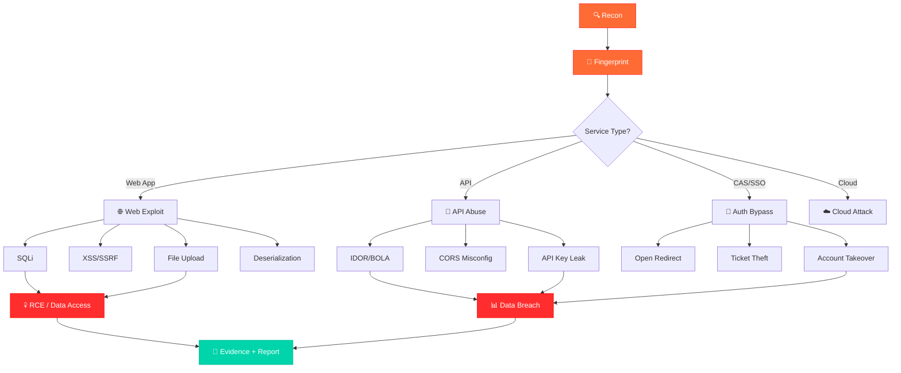

<p align="center">
  
</p>

<p align="center">
  <a href="#"></a>
  <a href="#"></a>
  <a href="#"></a>
  <a href="#"></a>
  <a href="https://agentskills.io"></a>
  <a href="LICENSE"></a>
</p>

<p align="center">
  <b>🔥 Battle-tested offensive security skills — works with ANY AI agent 🔥</b><br>
  <i>63 production-grade skills · 11 security subdomains · agentskills.io standard</i><br>
  <i>Compatible with Claude · GPT · Gemini · Llama · Hermes · LangChain · CrewAI · any agent</i>
</p>

---

<p align="center">
  <a href="#-quick-start">Quick Start</a> •
  <a href="#-agent-compatibility">Agent Compatibility</a> •
  <a href="#-skill-universe">Skills</a> •
  <a href="#-attack-chain-map">Attack Chain</a> •
  <a href="#-real-world-results">Results</a> •
  <a href="#-architecture">Architecture</a> •
  <a href="#-contributing">Contributing</a>
</p>

---

## 🤖 Agent Compatibility

```
  ┌─────────────────────────────────────────────────────────────────────┐
  │                    WORKS WITH EVERY AI AGENT                       │
  │                                                                     │
  │  ┌──────────┐  ┌──────────┐  ┌──────────┐  ┌──────────┐           │
  │  │  Claude   │  │   GPT    │  │  Gemini  │  │  Llama   │           │
  │  │  (Anthropic)  │  (OpenAI)  │  (Google)  │  │  (Meta)  │           │
  │  └──────────┘  └──────────┘  └──────────┘  └──────────┘           │
  │                                                                     │
  │  ┌──────────┐  ┌──────────┐  ┌──────────┐  ┌──────────┐           │
  │  │  Hermes  │  │LangChain │  │  CrewAI  │  │  AutoGPT │           │
  │  └──────────┘  └──────────┘  └──────────┘  └──────────┘           │
  │                                                                     │
  │  ┌──────────┐  ┌──────────┐  ┌──────────┐  ┌──────────┐           │
  │  │ MetaGPT  │  │  Cursor  │  │ Windsurf │  │   Cline  │           │
  │  └──────────┘  └──────────┘  └──────────┘  └──────────┘           │
  │                                                                     │
  │  Any agent that reads YAML frontmatter + Markdown body              │
  └─────────────────────────────────────────────────────────────────────┘
```

**How it works:** Each skill is a self-contained Markdown file with YAML frontmatter. The frontmatter enables ~30 token fast scanning for skill discovery. The body contains step-by-step instructions with real commands. No framework-specific runtime, no SDK, no dependencies.

```yaml
# YAML frontmatter — read by any agent for fast discovery
---
name: exploiting-sql-injection-with-sqlmap
description: >-
  Detect and exploit SQL injection using sqlmap for
  authorized penetration tests and CTF challenges.
domain: cybersecurity
subdomain: web-application-security
tags:
- sqlmap
- sqli
- owasp
- web-security
version: '1.0'
author: zxygeitio
license: Apache-2.0
mitre_attack:
- T1190
- T1059.007
nist_csf:
- DE.CM-01
- ID.RA-01
---

# Markdown body — self-contained playbook for any agent
## When to Use
- During authorized penetration testing
- To validate SQLi findings from scanners
...
```

---

## ⚡ Quick Start

```bash
# Clone
git clone https://github.com/zxygeitio/mo-Security-Skills.git

# Use with any agent — just point to the skills directory
# Claude: attach SKILL.md as context
# GPT: include in system prompt
# LangChain: load as Document objects
# Custom: parse YAML frontmatter for discovery, load body for execution
```

<details>
<summary>🐍 <b>Python — Universal Skill Loader</b></summary>

```python
import yaml, re, glob

def discover_skills(path="skills/*/SKILL.md"):
    """Fast discovery via YAML frontmatter (~30 tokens per skill)"""
    skills = []
    for f in glob.glob(path):
        with open(f) as fh:
            content = fh.read()
            m = re.match(r'^---\s*\n(.*?)\n---', content, re.DOTALL)
            if m:
                meta = yaml.safe_load(m.group(1))
                meta['_file'] = f
                skills.append(meta)
    return skills

def load_skill(name, path="skills/*/SKILL.md"):
    """Load full skill body by name"""
    for f in glob.glob(path):
        with open(f) as fh:
            content = fh.read()
            m = re.match(r'^---\s*\n(.*?)\n---\s*\n', content, re.DOTALL)
            if m:
                meta = yaml.safe_load(m.group(1))
                if meta.get('name') == name:
                    return {'meta': meta, 'body': content[m.end():]}
    return None

# Discover all skills
for skill in discover_skills():
    print(f"  [{skill.get('subdomain','?')}] {skill['name']}: {skill['description'][:70]}")

# Load specific skill
s = load_skill('exploit-chain')
print(s['body'][:500])
```

</details>

<details>
<summary>🔗 <b>LangChain — Load as Documents</b></summary>

```python
from langchain_community.document_loaders import DirectoryLoader, TextLoader
from langchain.text_splitter import RecursiveCharacterTextSplitter

loader = DirectoryLoader("skills/", glob="**/SKILL.md", loader_cls=TextLoader)
docs = loader.load()

# Each doc is a skill — split or use as-is
splitter = RecursiveCharacterTextSplitter(chunk_size=2000, chunk_overlap=200)
chunks = splitter.split_documents(docs)
```

</details>

<details>
<summary>🦙 <b>LlamaIndex — Build Skill Index</b></summary>

```python
from llama_index.core import SimpleDirectoryReader, VectorStoreIndex

documents = SimpleDirectoryReader("skills/", recursive=True).load_data()
index = VectorStoreIndex.from_documents(documents)
query_engine = index.as_query_engine()

# Ask: "What skills help with SQL injection?"
response = query_engine.query("SQL injection exploitation skills")
print(response)
```

</details>

---

## 🌌 Skill Universe

<p align="center">
  
</p>

### 🔍 Reconnaissance & Intelligence Gathering

```
  ┌──────────────────────────────────────────────────────────────┐
  │  PASSIVE RECON → ACTIVE SCAN → FINGERPRINT → JS/API REVERSE │
  │       ↓              ↓            ↓              ↓           │
  │  CT/Wayback     Port Scan    Tech Stack      API Endpoint   │
  │  Shodan/DB      Subdomain    WAF Detect      Key Extract    │
  │  DNS/WHOIS      Alive Probe  Version Map     Auth Bypass    │
  └──────────────────────────────────────────────────────────────┘
```

| Skill | What It Does | ATT&CK |
|:------|:-------------|:------:|
| 📡 `pentest-recon-driven` | 被动侦察→指纹→API/JS 逆向→精准验证 | T1595 T1592 T1590 |
| 🎣 `auto-recon-lowhanging` | 模块化服务探测 + SQLi盲注验证 + 协议枚举 | T1595 T1046 T1190 |
| 🔎 `rot-proxy-behind-discovery` | 证书O字段指纹识别ROT Proxy背后真实系统 | T1595 T1046 |
| 🌐 `openvpn-split-tunnel` | Split tunnel配置,保持本地+VPN双通 | T1133 |
| 🔧 `burp-suite-setup` | Burp Suite代理+HTTPS证书配置 | T1190 |
| ⚡ `hexstrike-usage` | HexStrike工具优先,HTTP API fallback | T1046 T1190 |
| 🔄 `hexstrike-api-fallback` | HexStrike bridge降级方案 | T1046 |
| 🛠️ `pentagi-cli-conversion` | PentAGI → 纯CLI工具改造 | — |

### 🎯 Vulnerability Hunting & Exploitation

```
  ┌─────────────────────────────────────────────────────────────────┐
  │                    VULNERABILITY EXPLOITATION PIPELINE          │
  │                                                                 │
  │  Target ──→ Fingerprint ──→ CVE Match ──→ PoC Build ──→ Verify │
  │    │           │              │              │             │     │
  │    ▼           ▼              ▼              ▼             ▼     │
  │  Domain    Tech Stack    Sploitus/      Minimal        Evidence  │
  │  IP/URL    Version       Exploit-DB     Safe PoC       Capture  │
  │                                                                 │
  │  ┌─── Chains ─────────────────────────────────────────────┐     │
  │  │ SQLi→RCE │ SSRF→Internal │ CORS+IDOR→Takeover │ CAS→  │     │
  │  │ FileUpload→Shell │ AuthBypass→Admin │ JWT→Forge      │     │
  │  └────────────────────────────────────────────────────────┘     │
  └─────────────────────────────────────────────────────────────────┘
```

| Skill | What It Does | ATT&CK |
|:------|:-------------|:------:|
| 💀 `exploit-chain` | 端到端攻击链: SQLi/上传/SSRF/反序列化/认证绕过 | T1190 T1059 T1078 |
| 🎯 `src-vuln-hunting` | SRC漏洞挖掘全流程: 目标快筛→攻击假设→证据门禁 | T1190 T1078 T1552 |
| ⚡ `web-pentest-fast` | 外网Web渗透快速流程: 轻量决策树、低噪声 | T1190 T1071 T1059 |
| 🗄️ `exploit-db-integration` | 47K+漏洞库 + 指纹→exploit自动映射 | T1190 T1588 |
| 🍃 `spring-boot-actuator-httptrace-exploitation` | Actuator httptrace敏感信息泄露 | T1190 T1213 |
| 🔐 `lianyi-cas-exploitation-patterns` | 统一身份认证CAS: Open Redirect→Ticket窃取 | T1078 T1133 |
| 📦 `nginx-cve-database` | Nginx CVE漏洞库 (2024-2026) | T1190 |
| 🎭 `nginx-spa-fallback-false-positive` | SPA fallback误报检测 | T1190 |
| 👻 `script-analysis-invisible-code` | Unicode零宽字符+隐形代码检测 | T1027 T1059 |
| 📊 `vuln-intel` | 漏洞情报: 实时CVE + 指纹→漏洞→利用映射 | T1588 T1592 |
| 📚 `vuln-intel-2025-2026` | 2025-2026最新漏洞情报库 | T1588 T1592 |
| 🧠 `smart-vuln-detector` | 智能漏洞检测: 基于指纹的特征匹配 | T1190 T1595 |

### 🏢 SRC-Specific Playbooks

```
  ┌────────────────────────────────────────────────────────────┐
  │              SRC VULNERABILITY HUNTING MODE                │
  │                                                            │
  │   Target ──→ Subdomain ──→ Fingerprint ──→ Pattern Match  │
  │     │            │             │                │          │
  │     ▼            ▼             ▼                ▼          │
  │   Scope      Asset Map    CAS/WAF/CMS     Known Exploits  │
  │   Verify     Alive Check  Version Lock    Chain Building  │
  │                                                            │
  │   ┌─────────────────────────────────────────────────┐      │
  │   │  🎓 教育  │  🏨 酒店  │  🎰 博彩  │  🚗 出行  │  🛒 电商  │
  │   └─────────────────────────────────────────────────┘      │
  └────────────────────────────────────────────────────────────┘
```

| Skill | Industry | Key Findings |
|:------|:---------|:-------------|
| 🎓 `education-src-blueprint` | 教育行业 | 统一身份认证 + Liferay + 统一认证攻击面 |
| 🎰 `mgm-src-testing-patterns` | 某博彩集团 | CMS系统 + ADFS + CORS泄露 + API密钥 |
| 💰 `qssrc-testing-patterns` | 某众筹平台 | API未授权 + IDOR + Passport认证绕过 |
| 👗 `shein-src-recon` | 某跨境电商 | 子域名枚举 + WAF识别 |
| 📖 `nisp-pentest-fusion` | 通用 | NISP知识体系 + SRC实战融合 |
| 🏫 `edu-auto-scanner` | 教育批量 | 批量探测 + 指纹→漏洞映射 + JS分析 |

### 🔗 Post-Exploitation & Lateral Movement

| Skill | ATT&CK | Description |
|:------|:------:|:------------|
| 🕸️ `pentest-lateral` | T1021 T1550 | 横向移动与内网渗透工具手册 |
| 🐚 `post-exploit-pwncat` | T1059 T1068 | Dumb Shell→PTY→提权→持久化 |
| 🔄 `pentest-ops` | T1190 T1021 | VPN→内网→ROT→漏洞→报告 |
| 🧰 `pentest-tool-mastery` | T1046 T1190 | 20+工具选型决策树 + 组合技 |

### 🤖 Agent & Automation

| Skill | Purpose | ATT&CK |
|:------|:--------|:------:|
| 🏗️ `pentest-unified-engine` | 统一渗透引擎: 目标图谱+智能路由+PoC+报告 | T1595 T1190 |
| 👥 `pentest-multiagent-system` | 多智能体并行渗透工作流 | T1595 T1190 |
| 📊 `agent-execution-monitor` | Loop Guard + 请求预算 + 工具调用审计 | T1059 |
| 📋 `agent-task-planner` | 复杂任务→3-7步结构化计划 | T1595 |
| 🎛️ `pentest-control-plane` | 统一调度所有渗透工具 | T1046 T1190 |
| 🤖 `pentest-agent-build` | Go语言CLI渗透Agent | T1059 |

### 🏴 CTF & Red Team

| Skill | Mode | ATT&CK |
|:------|:-----|:------:|
| 🏁 `ctf-playbook` | CTF | T1190 T1059 T1078 |
| ⚔️ `redteam-flag-mode` | Red Team | T1190 T1078 T1021 |
| 🧪 `local-pentest-practice-lab` | Practice | T1190 |

### 🛡️ CI/CD & DevSecOps

| Skill | ATT&CK |
|:------|:------:|
| 🔧 `cicd-pipeline-poisoning` | T1195 T1505 T1552 |

---

## 🗺️ Attack Chain Map



<p align="center">
  <b>MITRE ATT&CK Coverage: 11 Tactics · 45+ Techniques</b>
</p>

| Tactic | Techniques | Key Skills |
|:-------|:----------:|:-----------|
| 📡 Reconnaissance (TA0043) | 8 | `pentest-recon-driven`, `auto-recon-lowhanging` |
| 🏗️ Resource Development (TA0042) | 5 | `local-pentest-practice-lab`, `exploit-db-integration` |
| 🚪 Initial Access (TA0001) | 4 | `exploit-chain`, `lianyi-cas-exploitation-patterns` |
| ⚡ Execution (TA0002) | 2 | `exploit-chain`, `post-exploit-pwncat` |
| 🔒 Persistence (TA0003) | 3 | `cicd-pipeline-poisoning` |
| ⬆️ Privilege Escalation (TA0004) | 2 | `exploit-chain`, `pentest-lateral` |
| 🛡️ Defense Evasion (TA0005) | 1 | `nginx-spa-fallback-false-positive` |
| 🔑 Credential Access (TA0006) | 2 | `lianyi-cas-exploitation-patterns` |
| 🔍 Discovery (TA0007) | 3 | `auto-recon-lowhanging`, `pentest-recon-driven` |
| ↔️ Lateral Movement (TA0008) | 2 | `pentest-lateral`, `pentest-ops` |
| 📦 Collection (TA0009) | 2 | `exploit-chain`, `src-vuln-hunting` |
| 📤 Exfiltration (TA0010) | 2 | `exploit-chain` |

> 📖 Full mapping: [ATTACK_COVERAGE.md](ATTACK_COVERAGE.md)

---

## 🏆 Real-World Results

<p align="center">
  
</p>

<table>
<tr>
<td align="center" width="25%">
<br>
<b>High</b><br>
<sub>CORS泄露 + API数据<br>WAF绕过 + 企业代码缺陷</sub>
</td>
<td align="center" width="25%">
<br>
<b>Critical: 5H / 7M / 3L</b><br>
<sub>AppSecret→敏感数据<br>未授权+IDOR(多品牌)</sub>
</td>
<td align="center" width="25%">
<br>
<b>High</b><br>
<sub>Kong OAuth双斜杠绕过<br>VIP API 120端点</sub>
</td>
<td align="center" width="25%">
<br>
<b>High</b><br>
<sub>CAS Open Redirect<br>统一认证攻击面</sub>
</td>
</tr>
<tr>
<td align="center">
<br>
<b>Medium</b><br>
<sub>Config.js泄露<br>__NEXT_DATA__泄露</sub>
</td>
<td align="center">
<br>
<b>High</b><br>
<sub>API未授权/IDOR<br>Passport认证绕过</sub>
</td>
<td align="center">
<br>
<b>Medium</b><br>
<sub>CORS修复验证<br>OA V9.0SP1</sub>
</td>
<td align="center">
<br>
<b>High</b><br>
<sub>统一认证全线CORS<br>Open Redirect窃取Ticket</sub>
</td>
</tr>
</table>

---

## 🏗️ Architecture

```
  ┌──────────────────────────────────────────────────────────────────────┐
  │                    UNIVERSAL SKILL ARCHITECTURE                      │
  │                   (agentskills.io v2.0 Standard)                    │
  │                                                                     │
  │   ┌─────────────────────────────────────────────────────────────┐   │
  │   │                    YAML FRONTMATTER                         │   │
  │   │   name · description · domain · subdomain · tags · version  │   │
  │   │   author · license · mitre_attack · nist_csf                │   │
  │   │                                                             │   │
  │   │   ┌─────────────────────────────────────────────────────┐   │   │
  │   │   │         ~30 TOKEN FAST DISCOVERY                    │   │   │
  │   │   │   Any agent scans frontmatter → matches skill       │   │   │
  │   │   └─────────────────────────────────────────────────────┘   │   │
  │   └─────────────────────────────────────────────────────────────┘   │
  │                           │                                         │
  │                           ▼                                         │
  │   ┌─────────────────────────────────────────────────────────────┐   │
  │   │                    MARKDOWN BODY                            │   │
  │   │   ## When to Use    — Trigger conditions                   │   │
  │   │   ## Prerequisites  — Tools, access, environment           │   │
  │   │   ## Steps          — Numbered workflow with commands       │   │
  │   │   ## Key Concepts   — Reference tables                    │   │
  │   │   ## Expected Output — What agent should produce           │   │
  │   └─────────────────────────────────────────────────────────────┘   │
  │                           │                                         │
  │                           ▼                                         │
  │   ┌─────────────────────────────────────────────────────────────┐   │
  │   │                    SUPPORTING FILES                        │   │
  │   │   references/  — Standards, CVE refs, deep procedures     │   │
  │   │   scripts/     — Working helper scripts                   │   │
  │   │   assets/      — Templates, checklists                    │   │
  │   │   LICENSE       — Apache 2.0                              │   │
  │   └─────────────────────────────────────────────────────────────┘   │
  └──────────────────────────────────────────────────────────────────────┘
```

### Subdomain Distribution

```
penetration-testing    ████████████████████░░  21 skills
web-application-security ████░░░░░░░░░░░░░░░░   4 skills
vulnerability-management ████░░░░░░░░░░░░░░░░   4 skills
threat-intelligence    ██░░░░░░░░░░░░░░░░░░░░   2 skills
soc-operations         ██░░░░░░░░░░░░░░░░░░░░   2 skills
red-teaming            ██░░░░░░░░░░░░░░░░░░░░   2 skills
api-security           █░░░░░░░░░░░░░░░░░░░░░   1 skill
devsecops              █░░░░░░░░░░░░░░░░░░░░░   1 skill
identity-access-mgmt   █░░░░░░░░░░░░░░░░░░░░░   1 skill
malware-analysis       █░░░░░░░░░░░░░░░░░░░░░   1 skill
network-security       █░░░░░░░░░░░░░░░░░░░░░   1 skill
```

---

## 🧬 Skill Anatomy

```
skills/exploit-chain/
├── SKILL.md              ← YAML frontmatter + Markdown playbook
├── references/           ← Deep technical references
├── scripts/              ← Working helper scripts
├── assets/               ← Templates & checklists
└── LICENSE               ← Apache 2.0
```

<details>
<summary>📄 <b>Full SKILL.md Example</b></summary>

```yaml
---
name: exploiting-sql-injection-with-sqlmap
description: >-
  Detect and exploit SQL injection using sqlmap for
  authorized penetration tests and CTF challenges.
domain: cybersecurity
subdomain: web-application-security
tags:
- sqlmap
- sqli
- owasp
- web-security
- penetration-testing
version: '1.0'
author: zxygeitio
license: Apache-2.0
mitre_attack:
- T1190
- T1059.007
nist_csf:
- DE.CM-01
- ID.RA-01
---

# SQL Injection Exploitation with sqlmap

## When to Use
- During authorized penetration testing engagements
- To validate SQLi findings from scanners
- For CTF challenges involving SQL injection

## Prerequisites
- Authorization: Written Rules of Engagement
- Tools: sqlmap, Python 3.6+, Burp Suite
- Access: Network connectivity to target

## Steps
1. Identify injection points...
2. Run sqlmap basic detection...
3. Enumerate database structure...
...

## Expected Output
JSON report with findings, evidence, and MITRE ATT&CK mapping.
```

</details>

---

## 📊 Repository Stats

<p align="center">
<table>
<tr>
<td align="center" width="20%">
<br><b>Skills</b>
</td>
<td align="center" width="20%">
<br><b>Subdomains</b>
</td>
<td align="center" width="20%">
<br><b>Files</b>
</td>
<td align="center" width="20%">
<br><b>ATT&CK</b>
</td>
<td align="center" width="20%">
<br><b>Targets</b>
</td>
</tr>
</table>
</p>

---

## 🛠️ Tools Covered

<p align="center">
<a href="https://nmap.org"></a>
<a href="https://nuclei.projectdiscovery.io"></a>
<a href="https://portswigger.net/burp"></a>
<a href="https://sqlmap.org"></a>
<a href="https://github.com/projectdiscovery/httpx"></a>
<a href="https://exploit-db.com"></a>
<a href="https://sploitus.com"></a>
<a href="https://github.com"></a>
</p>

---

## 🤝 Contributing

See [CONTRIBUTING.md](CONTRIBUTING.md) for full guidelines.

**Maintenance tooling** (`scripts/`, requires `pip install pyyaml`):

| Command | Purpose |
|:--------|:--------|
| `python scripts/build_index.py` | Regenerate `index.json` from every top-level SKILL.md frontmatter (never hand-edit the index) |
| `python scripts/build_index.py --check` | CI gate — fail if `index.json` is stale |
| `python scripts/validate_skills.py` | Validate the frontmatter contract (name ↔ directory, real descriptions, no leaked private IPs); warns on missing discovery tags |

Both checks run automatically on every push and PR via GitHub Actions.

```
  ┌──────────────────────────────────────────────┐
  │         CONTRIBUTING WORKFLOW                │
  │                                              │
  │  1. 🍴 Fork the repo                        │
  │  2. 📁 Create skills/<your-skill>/SKILL.md  │
  │  3. 📝 Add references/ + scripts/ + assets/ │
  │  4. ✅ Security scan (no hardcoded secrets) │
  │  5. 🚀 Submit Pull Request                  │
  │                                              │
  └──────────────────────────────────────────────┘
```

---

## 📜 License

<p align="center">
<a href="LICENSE"></a>
</p>

---

## ⚠️ Disclaimer

> 🛡️ **This is an offensive security toolkit for authorized testing only.**
>
> All skills are designed for: authorized SRC vulnerability disclosure · CTF competitions · authorized red team engagements · security research in controlled environments.
>
> **Unauthorized access to computer systems is illegal.** Users are responsible for ensuring proper authorization.

---

<p align="center">
  
</p>

<p align="center">
  <sub>Built with ❤️ by <a href="https://github.com/zxygeitio">zxygeitio</a> · Follows <a href="https://agentskills.io">agentskills.io</a> standard</sub>
</p>
