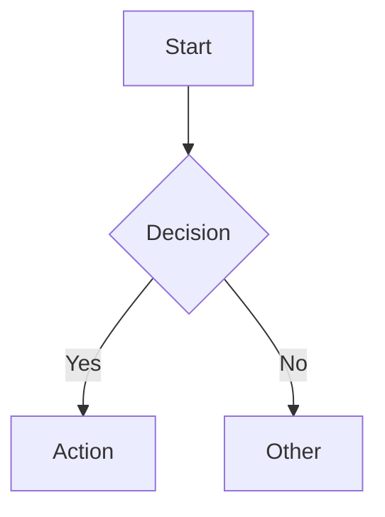

# GitHub README 视觉设计速查

## 免费外部服务（无需托管图片）

### 渐变波浪 Header/Footer
```
https://capsule-render.vercel.app/api?type=waving&color=0:0d1117,50:ff6b35,100:ff2d2d&height=220&section=header&text=PROJECT_NAME&fontSize=50&fontColor=ffffff&animation=fadeIn&fontAlignY=35&desc=SUBTITLE&descSize=16&descAlignY=55
```
参数: `type`=waving/shark/softSlice, `color`=渐变色(0:start,50:mid,100:end), `height`, `section`=header/footer

### 打字机动画
```
https://readme-typing-svg.demolab.com?font=JetBrains+Mono&weight=600&size=22&pause=1000&color=FF6B35&center=true&vCenter=true&multiline=true&repeat=true&width=600&height=100&lines=Line1;Line2
```

### Shields.io 徽章
```
https://img.shields.io/badge/LABEL-VALUE-COLOR?style=for-the-badge&logo=LOGO&logoColor=white
```
- `style`: `for-the-badge`(大), `flat`(小), `flat-square`(方)
- `logo`: simpleicons.org 的 slug (如 `python`, `docker`, `shield`)
- 动态: `/github/stars/user/repo`, `/github/license/user/repo`

## GitHub 原生功能

### Mermaid 流程图
````

````
直接渲染，无需外部服务。支持 graph/sequence/gantt/pie 等图表类型。

### 可折叠内容
```html
<details>
<summary>点击展开标题</summary>
隐藏的内容...
</details>
```

### ASCII 流程图
```
┌──────────────────────────────┐
│  STEP 1 → STEP 2 → STEP 3   │
│    ↓          ↓         ↓    │
│  Input    Process    Output  │
└──────────────────────────────┘
```
兼容所有终端和渲染器。

## 组合模板

```markdown
<p align="center">
  <!-- 1. 渐变波浪 header -->
  
</p>

<p align="center">
  <!-- 2. 徽章行 -->
  <a href="#"></a>
  ...
</p>

<!-- 3. 打字机动画 -->
<p align="center">
  
</p>

<!-- 4. ASCII 流程图 -->
<!-- 5. 分类表格 + emoji -->
<!-- 6. Mermaid 图表 -->
<!-- 7. 折叠代码块 -->
<!-- 8. 渐变波浪 footer -->
```
